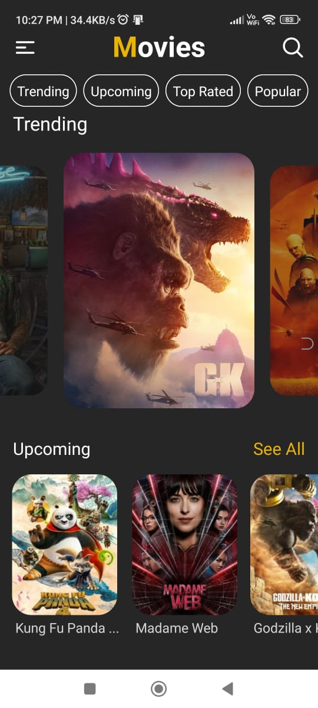
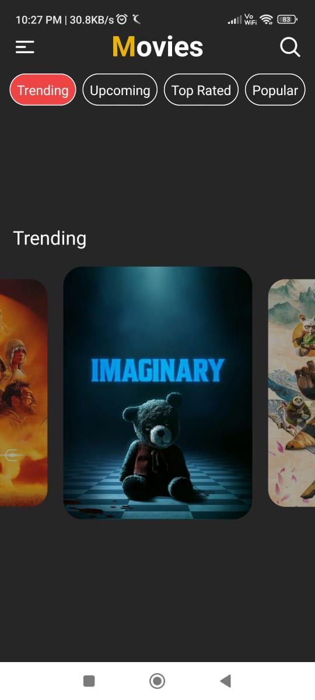

# MovieApp - React Native

MovieApp is a feature-rich mobile application that allows users to explore and interact with a vast collection of movies and their associated details. It provides an immersive experience for movie enthusiasts to discover, search, and engage with movies, cast, and trending content.

## Key Features

### Movie Search and Details
- **Search Movies:** Users can search for movies by title, genre, or keywords.
- **Movie Details:** View detailed information about a movie, including its title, overview, release date, runtime, genres, and average rating.

### Cast Information
- **Cast Details:** Access in-depth profiles of movie cast members, including their biography, birthdate, and a list of movies they have appeared in.
- **Favorite Cast:** Users can mark their favorite cast members for easy access.

### User Interactions
- **Favorite Movies:** Add movies to a personal favorites list.
- **Favorite Cast:** Save cast members as favorites for future reference.

### Similar Movies
- **Explore Similar Movies:** Discover movies that are similar to the one you're currently viewing.

### Trending and Top Movies
- **Trending Movies:** Stay up to date with the latest trending movies in the industry.
- **Top 10 Movies:** Find the top-rated movies based on user reviews and ratings.

## Technologies Used
MovieApp is built using the following technologies:

- **React Native:** A popular framework for building mobile applications using JavaScript and React.
- **Expo:** A set of tools and services for developing React Native applications.
- **TheMovieDB API:** A comprehensive movie database providing access to movie information, cast details, and much more.

## Getting Started

### Installation

1. Clone the repository.
   ```shell
   git clone https://github.com/ritiktyagi123/MovieApp.git

  

## Get Started

install dev dependencies

### `npm install`

## Then

go to https://www.themoviedb.org, create an account and get the api key, then use that api key in constants/index.js file

## Then

Run The app

### `npm start`

Runs your app in development mode.

Open it in the [Expo app](https://expo.io) on your phone to view it. It will reload if you save edits to your files, and you will see build errors and logs in the terminal.

#### `npm run ios`

Like `npm start` / `yarn start`, but also attempts to open your app in the iOS Simulator if you're on a Mac and have it installed.

#### `npm run android`

Like `npm start` / `yarn start`, but also attempts to open your app on a connected Android device or emulator. Requires an installation of Android build tools (see [React Native docs](https://facebook.github.io/react-native/docs/getting-started.html) for detailed setup).

<br />

### Screenshots






